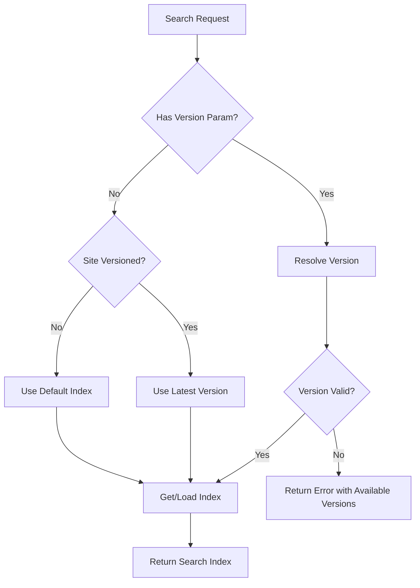

# Design Document

## Overview

This design enhances the existing SearchIndexFactory to provide robust version-aware search indexing for MkDocs sites. The solution maintains backward compatibility while adding sophisticated version resolution, caching, and error handling capabilities.

## Architecture

### Core Components

```
SearchIndexFactory (Enhanced)
├── VersionManager
│   ├── Version Detection
│   ├── Version Resolution  
│   └── Alias Handling
├── IndexCache
│   ├── Memory Management
│   ├── LRU Eviction
│   └── Concurrent Access Control
└── IndexLoader
    ├── Fetch Coordination
    ├── Error Handling
    └── Retry Logic
```

### Version Resolution Flow



## Components and Interfaces

### Enhanced SearchIndexFactory

```typescript
export class SearchIndexFactory {
  private readonly versionManager: VersionManager;
  private readonly indexCache: IndexCache;
  private readonly indexLoader: IndexLoader;
  
  constructor(baseUrl: string, options?: SearchIndexOptions) {
    this.versionManager = new VersionManager(baseUrl);
    this.indexCache = new IndexCache(options?.cacheOptions);
    this.indexLoader = new IndexLoader(baseUrl, this.versionManager);
  }

  async getSearchIndex(version?: string): Promise<SearchIndex | undefined>
  async resolveVersion(version: string): Promise<VersionResolution>
  async getAvailableVersions(): Promise<VersionInfo[] | undefined>
  async clearCache(version?: string): Promise<void>
}
```

### VersionManager

```typescript
interface VersionManager {
  detectVersioning(): Promise<boolean>
  fetchVersions(): Promise<VersionInfo[] | undefined>
  resolveVersion(version?: string): Promise<VersionResolution>
  buildVersionedUrl(path: string, version?: string): Promise<string>
  invalidateCache(): void
}

interface VersionInfo {
  title: string;
  version: string;
  aliases: string[];
}

interface VersionResolution {
  valid: boolean;
  resolved: string;
  isDefault: boolean;
  available?: VersionInfo[];
  error?: string;
}
```

### IndexCache

```typescript
interface IndexCache {
  get(key: string): SearchIndex | undefined
  set(key: string, index: SearchIndex): void
  has(key: string): boolean
  delete(key: string): boolean
  clear(): void
  size(): number
  getStats(): CacheStats
}

interface CacheOptions {
  maxSize?: number;
  maxMemoryMB?: number;
  ttlMinutes?: number;
}
```

### IndexLoader

```typescript
interface IndexLoader {
  loadIndex(version?: string): Promise<SearchIndex>
  isLoading(version?: string): boolean
  getLoadingPromise(version?: string): Promise<SearchIndex> | undefined
}
```

## Data Models

### SearchIndex (Enhanced)

```typescript
interface SearchIndex {
  version: string;
  url: string;
  index: lunr.Index | undefined;
  documents: Map<string, DocumentData> | undefined;
  metadata: IndexMetadata;
}

interface IndexMetadata {
  loadedAt: Date;
  size: number;
  documentCount: number;
  isDefault: boolean;
}
```

### Cache Key Strategy

- **Versioned sites**: `${baseUrl}:${resolvedVersion}`
- **Non-versioned sites**: `${baseUrl}:default`
- **Loading locks**: `${baseUrl}:${version}:loading`

## Error Handling

### Version Resolution Errors

```typescript
class VersionNotFoundError extends Error {
  constructor(
    public readonly requestedVersion: string,
    public readonly availableVersions: VersionInfo[]
  ) {
    super(`Version '${requestedVersion}' not found`);
  }
}

class VersionDetectionError extends Error {
  constructor(
    public readonly baseUrl: string,
    public readonly cause: Error
  ) {
    super(`Failed to detect versioning for ${baseUrl}`);
  }
}
```

### Error Recovery Strategy

1. **Version File Unavailable**: Fall back to non-versioned behavior
2. **Invalid Version**: Return error with available versions
3. **Index Load Failure**: Retry with exponential backoff (3 attempts)
4. **Network Timeout**: Use cached version data if available
5. **Memory Pressure**: Evict LRU indexes and retry

## Testing Strategy

### Unit Tests

- **VersionManager**: Version detection, resolution, and alias handling
- **IndexCache**: Cache operations, eviction, and memory management  
- **IndexLoader**: Concurrent loading, error handling, and retries
- **SearchIndexFactory**: Integration of all components

### Integration Tests

- **Version Resolution Flow**: End-to-end version resolution with real version files
- **Cache Behavior**: Multi-version caching and eviction scenarios
- **Error Scenarios**: Network failures, malformed data, and recovery

### Performance Tests

- **Memory Usage**: Index size and cache memory consumption
- **Concurrent Access**: Multiple simultaneous requests for same/different versions
- **Load Time**: Index loading performance with various document sizes

## Implementation Phases

### Phase 1: Core Version Management
- Enhance VersionManager with robust version resolution
- Implement comprehensive error handling
- Add version validation and alias support

### Phase 2: Advanced Caching
- Implement IndexCache with LRU eviction
- Add memory management and size limits
- Implement concurrent access control

### Phase 3: Enhanced Loading
- Add IndexLoader with retry logic
- Implement loading coordination to prevent duplicates
- Add detailed error reporting

### Phase 4: Integration & Testing
- Integrate all components into SearchIndexFactory
- Add comprehensive test coverage
- Performance optimization and monitoring
